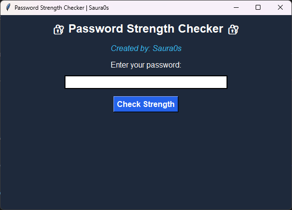
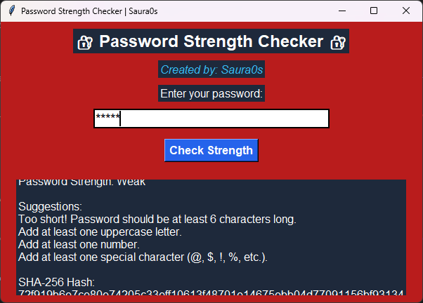
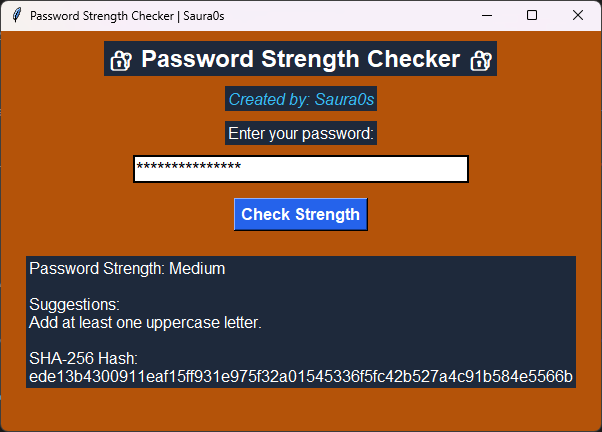
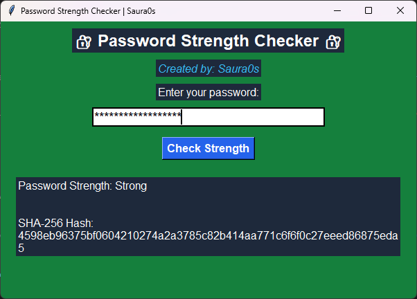

<div align="center">

# 🔐 Password Strength Checker & Analyzer

[](https://www.python.org/)
[](https://docs.python.org/3/library/tkinter.html)
[](https://en.wikipedia.org/wiki/SHA-2)
[](LICENSE)

<p align="center">
  <b>An interactive desktop application built in Python for evaluating password complexity, measuring entropy, providing hardening suggestions, and generating SHA-256 cryptographic hashes.</b>
</p>

</div>

---

## ✨ Features

* ⚡ **Real-Time Dynamic Evaluation**: Evaluates password resilience as you type.
* 📊 **Multi-Factor Entropy Analysis**: Checks length, character variety (uppercase, lowercase, numbers, special symbols), and common pattern weaknesses.
* 🎨 **Visual Feedback Matrix**: Instant color-coded indicators for **Weak** (Red), **Medium** (Orange/Yellow), and **Strong** (Green) ratings.
* 🛡️ **Cryptographic SHA-256 Hash Display**: Generates and shows real-time cryptographic hash representation of the input.
* 🖥️ **Lightweight GUI**: Fast and standalone desktop interface powered by Python's native Tkinter.

---

## 🖼️ Application Preview

| Main Interface | Weak Evaluation | Medium Evaluation | Strong Evaluation |
| :---: | :---: | :---: | :---: |
|  |  |  |  |

---

## 🚀 Quickstart & Installation

### 1. Clone the Repository
```bash
git clone https://github.com/Saura0S/password-strength-checker.git
cd password-strength-checker
```

### 2. Run the Application
```bash
python password_checker_ui.py
```
*(Requires Python 3.6+ with standard Tkinter support included in default Python distributions).*

---

## 🔐 Password Security Best Practices

> **💡 Security Guidelines**:
> 1. **Length Matters**: Aim for at least 14–16 characters.
> 2. **Avoid Common Substitutions**: Avoid dictionary words or predictable number/symbol substitutions (e.g. `P@ssw0rd`).
> 3. **Use a Password Manager**: Use unique, randomly generated credentials across every service.

---

## 👤 Author & Connect

Developed by **Saurabh ([@Saura0S](https://github.com/Saura0S))**.

* 🌐 **GitHub**: [@Saura0S](https://github.com/Saura0S)
* 🎮 **Discord Community**: [Join Discord](https://discord.gg/523wGqAP4W)
* 📸 **Instagram**: [@SAURABH_xt_0](https://www.instagram.com/SAURABH_xt_0)

---

## 📄 License

Distributed under the [MIT License](LICENSE).